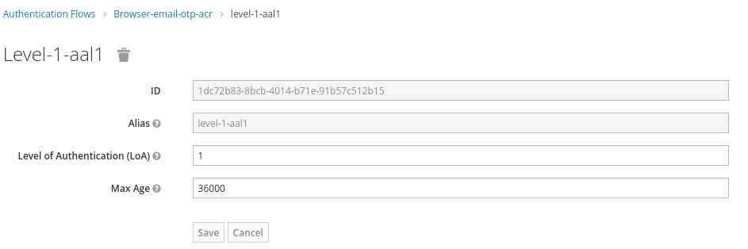

# Red Hat Single Sign-On - Step-Up Authentication

This repo has a sample application using the[Keycloak JavaScript Adapter](https://access.redhat.com/documentation/en-us/red_hat_single_sign-on/7.6/html-single/securing_applications_and_services_guide/index#javascript_adapter_reference)
to implement an step-up mechanism.

The workflow implemented is:

**First Login Step**

* Users authenticate using their username and password credentials

**Second Login Step**

* Only the users with the `super-user` role enabled can login into the secured area of
the application (`/secured` url)

This app was tested with Red Hat Single Sign-On 7.6 using a realm called `demo`.

**NOTE:** This repo requires to have installed in Red Hat Single Sign-On the
Email OTP provider from this [repository](https://github.com/rmarting/keycloak-2fa-email-authenticator).

## Build

To install the required node modules:

```shell
npm install 
```

The `KC_URL` environment variable identify the Red Hat Single Sign-On url, for
example `http://localhost:8180`.

To start:

```shell
npm start
```

The application will be available at `http://localhost:8280`.

## Red Hat Single Sign-On - Step-up Authorization Flow

1. Create the ACR to LoA mapping in the realm settings with the following
values:

* `aal1` to define the first step login
* `aal2` to define the second step login


2. Create the browser login flow with step-up mechanism similar to the
following screenshot:


Each `Condition - Level of Authentication` should be similar to:

* For the first step login (`aal1`):



* For the second step login (`aal2`):


The second login step adds another condition to check the right user attribute,
in our case the `super-user` attribute.


## Red Hat Single Sign-On - Client

Create the a client identified as `step-up-client` in the `demo` realm. This client definition
will include a Mapper to map the user attribute into the token, such as:


## Red Hat Single Sign-On - Users

1. Create a common user (adding the value `false` to the `super-user` attribute, or without any attribute). This user will not be able to login into the secured area.

2. Create a super user (adding the value `true` to the `super-user` attribute). This user will
be able to login into the secured area.

## Main References

* [ACR to Level of Authentication (LoA) Mapping](https://access.redhat.com/documentation/en-us/red_hat_single_sign-on/7.6/html-single/server_administration_guide/index#mapping-acr-to-loa-realm)
* [Creating a browser login flow with step-up mechanism](https://access.redhat.com/documentation/en-us/red_hat_single_sign-on/7.6/html-single/server_administration_guide/index#step-up-flow)
* [Parameters forwarding](https://access.redhat.com/documentation/en-us/red_hat_single_sign-on/7.6/html-single/securing_applications_and_services_guide/index#params_forwarding)
